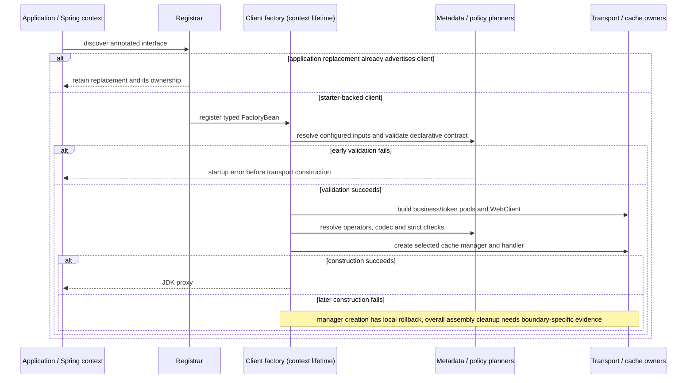
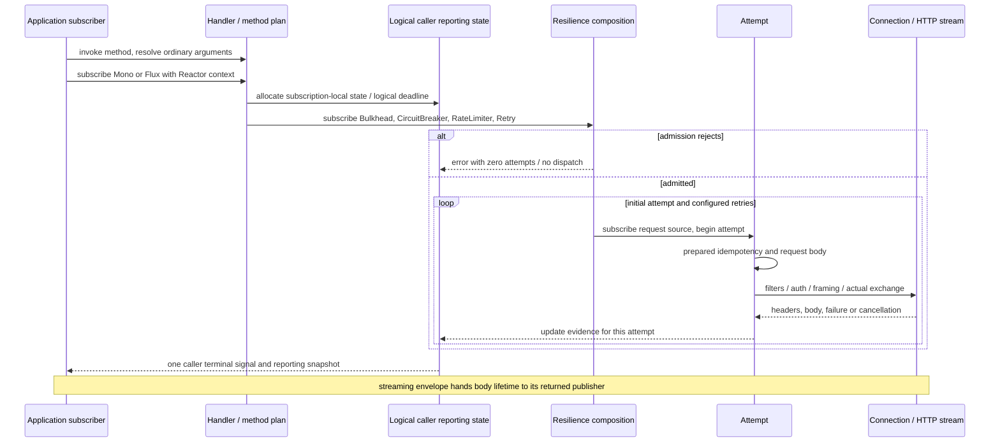
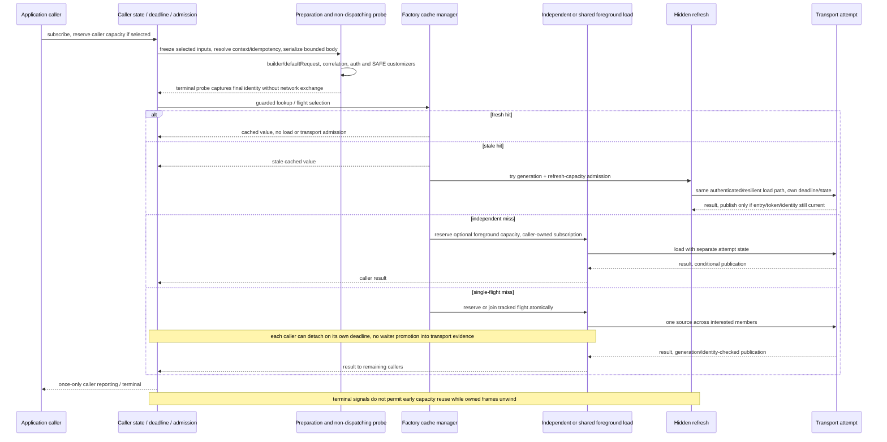
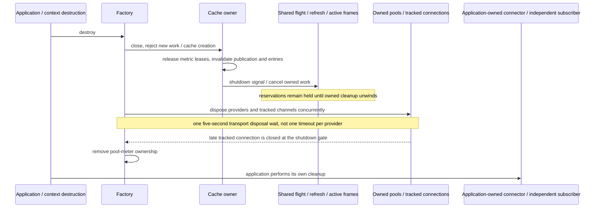

# V32 Architecture, Contract, and Ownership Map

> **Status:** as-is review, Priority 2
> **Reviewed:** 2026-09-14
> **Source baseline:** `876bbda919a9f9720926f3e1277e38fadd95ddaa`
> **Published / development:** `4.4.0` / `4.5.0-SNAPSHOT`
> **Implementation and release scope:** unselected

Companion to [the checklist](CHECKLIST.md), [baseline inventory](BASELINE-SCOPE.md)
and [finding register](FINDINGS.md). This is not a whole-system proof. Source
inspection establishes the paths below; named tests establish only the assertions
they actually make. The verification ledger distinguishes newly run checks from
indexed coverage. Open questions are not confirmed defects, and Priority 8.3 still
requires an explicit maintainer decision before production changes.

## Module and Dependency Map

Current Priority 9 delta (2026-09-16): [accepted improvements](ACCEPTED-IMPROVEMENTS.md)
adds local rollback after successful manager allocation but failed public handler
construction. No module, request pipeline or ownership transfer on success changes.
F005 separates ordinary cleanup checks from 16 controlled-JVM reachability cases.
The dated as-is map below remains the review baseline; Priority 10 is still pending.

| Module or lane | Dependency direction and linkage | Boundary |
|---|---|---|
| [Root reactor][root-pom] | Default modules: starter, test helper, OTel; benchmarks selected by profile | Owns version/BOM/API-baseline alignment, not runtime request state |
| [Starter][starter-pom] | Boot auto-configuration, WebClient/WebFlux, Reactor Netty, Jackson 3 and SLF4J; optional Caffeine, Resilience4j, Micrometer and Actuator integrations | Registry/bean presence and explicit configuration still determine activation; a transitive class alone is not an operator selection |
| [Test helper][test-pom] | Depends on starter, Caffeine, Reactor, Spring test and assertions; JUnit API optional | Public `...test.MockReactiveHttpClient` plus a `...core.MockResponseCacheSupport` bridge share the starter package to reach internal machinery |
| [OTel][otel-pom] | Depends on starter, OTel API and Boot integration; SDK used in tests, not owned by the starter | Application supplies the OpenTelemetry instance/SDK and owns its lifecycle; no reverse starter dependency |
| [Benchmarks][benchmark-pom] | Depend on production artifacts and measurement tools | Same-package benchmark access is evidence cooperation, not proof of an externally supported SPI |
| [Assembled consumer][consumer-pom], [native smoke][native-pom], [verification scripts][scripts] | Separate artifact-consuming applications and shell evidence lanes | Exercise assembled/classpath/native boundaries; not dependencies of an application using the starter |

The helper's public internal bridge and public factory/handler entry points cannot
be deemed removable merely because they are outside the preferred user-facing
API. [Mock construction][mock] delegates through [the bridge][mock-cache]; [AOT
processing][aot] discovers starter factories rather than all annotated replacement
clients. Priority 7 will audit linkage and compatibility from external consumers.

## Supported Extension Surfaces

| Supported surface and guidance | Selection / replacement behavior | Ownership and limits |
|---|---|---|
| Declarative annotations, properties, `MethodMetadataCache`; [configuration][properties-doc] | [Registrar][registrar] backs off for an existing advertised client; [factory][factory] resolves the configured metadata bean before grammar validation | Replacement client factories own their invocation semantics. A custom parser is not permission to skip the starter grammar on a starter-owned proxy |
| `AuthProvider`, invalidation and `AuthProviderFactory`; [auth guide][auth-doc] | Named provider first, otherwise first supporting ordered eligible factory; hierarchy, shadowing and bean-factory candidate/order metadata matter | Provider/custom factory may be application-owned. Built-in OAuth2 token-service transport is a separate factory-owned pool; it is not a business attempt |
| `ReactiveHttpClientCustomizer`, Boot `WebClientCustomizer`, replacement builder/connector; [customizer guide][customizer-doc] | Boot customizers prepare the prototype builder; factory adds correlation/auth filters, then matching ordered per-client customizers, framing and final-request observation | Cache selection requires applicable customization beans classified SAFE, including non-filter mutations. This acknowledgement is not a sandbox for arbitrary code. An application connector keeps application lifecycle responsibility |
| `ReactiveHttpClientJsonCodec`; [codec configuration][json-config] | Application bean replaces the Boot Jackson implementation | Cache-selected JSON requires bounded serialization; the SPI default does not promise a bounded writer for arbitrary replacement codecs |
| [`DefaultErrorDecoder`][decoder] replacement, `ErrorResponseMapper`; [error guide][error-doc] | Decoder bean resolves per client; default decoder selects the first supporting ordered mapper with a result | Default bounded decoding differs from arbitrary custom decoding. Default `forClient` copying does not establish isolation for every subclass |
| `HttpClientObserver`, lifecycle hooks, exchange loggers; [contexts][contexts-doc], [hooks][hooks-doc] | Handler resolves optional ordered callbacks; named Micrometer observer backoff and integration conditions belong to auto-configuration | Terminal objects can contain errors/body information. Custom sinks must apply their documented redaction policy; these objects are not sanitized support bundles |
| `RequestContext`, `RequestContextSnapshot`; [context guide][correlation-doc] | Inbound WebFlux capture is replaceable; named header helpers differ from bulk map access; handoff is explicit | Snapshot defensively copies supported inbound fields, not every arbitrary Reactor value. Applications own detached subscriptions, queues, ThreadLocal bridges and header DTO parsing |
| Effective contracts, diagnostics provider/endpoint; [diagnostic guide][contexts-doc] | Provider replacement and summary-only paths retain unknown facts; endpoint separately opt-in | Inspection must not instantiate unresolved registries/auth products just to turn unknown into a definite answer |
| `MockReactiveHttpClient`; [helper guide][helper-doc] | Explicit mock configuration and custom operator/codec/observer inputs; optional deterministic cache clock | Mock owns its cache control and context in either clock mode. It does not prove connector, TCP, TLS, proxy or H2 behavior |
| [OTel auto-configuration][otel-config] and propagation | Optional OpenTelemetry bean and property conditions; observer/filter/customizer backoff | SDK/exporter ownership stays outside the starter; copied Reactor context is not automatic propagation through an application-created task |

[Auto-configuration][auto-config], [factory selection][factory],
[auth candidate helpers][auth-candidates] and [diagnostics][diagnostics] cooperate
but are not one interchangeable bean-resolution routine: runtime creation,
non-instantiating inspection and AOT have different obligations. This inventory
does not propose another SPI or module split.

## Authoritative Inputs

| Input / decision | Consumer and precedence | Lifetime / caveat |
|---|---|---|
| Bound `ReactiveHttpClientProperties`, programmatic replacement, annotation client metadata | [Factory][factory] selects client config; annotation base URL overrides the property value; configured API refs supply their method/target | Properties are mutable objects, not a globally immutable configuration snapshot |
| [Method metadata][metadata] and concrete client interface | Metadata cache parses once per Method; [RequestPlan][plan] resolves inherited generic owners, arrays and bindings for the concrete interface | Handler caches plans and effective cache decisions per method. Startup checks parameter, URI, return and cache grammar before normal proxy use |
| [Effective resilience policy][resilience-policy] | Master switch, explicit method-over-client instance selection, retry HTTP-method eligibility and Mono/Flux operator availability | Enabled-only is not implicit activation. Active method annotation names receive instance validation; client-selected names may use registry defaults |
| [Effective cache policy][cache-policy] and [work policy][work-policy] | Disabled annotation, method selection, client selection, semantic-read eligibility, variants, bounded storage and optional work limits | Selection retains the policy object; work selection is frozen/checked. Cache-map access rejects changed storage bounds instead of accumulating new bound tuples. This does not freeze every property |
| Invocation arguments and Reactor context | Ordinary invocation resolves request arguments before returning the reactive pipeline; cache selection defers bounded selected-input freezing per subscription | No universal deep-copy guarantee for ordinary calls or acknowledged unselected cache inputs |
| [CacheKeyContract][key] and [handler preparation][handler] | Selected request/context snapshots, idempotency resolution, bounded serialized body and finalized non-dispatching request probe produce identity | Auth-visible bytes are isolated from wire/key bytes. Publication checks actual final identity after replay; a mismatch is not a cache fill |
| Application bean definitions/singletons | Runtime factory may instantiate dependencies; diagnostics examines available singleton/product state; AOT honors replacement metadata and configured primary properties | Summary/unknown inspection is not the same operation as proxy construction or native reachability analysis |
| [Contract exporter][exporter] and diagnostics renderers | Derive effective structural facts from the above, respecting starter ownership | Export is not another policy authority and cannot prove dynamic custom code safe |

## Execution Sequences

### Startup and Failure

[Factory.getObject][factory] has no encompassing rollback block for every failure
after transport creation. [Manager creation][manager] closes a partially
initialized manager on its own construction failure; that narrower rule does not
prove all late handler/strict-check/proxy failures clean up. Spring destruction
and direct factory use have different owners. See Q1, not a claimed leak.

[AOT][aot] inspects starter factory definitions, including factory-method return
types, validates through replacement metadata and registers proxy/reflection
hints. It is a build-time path, not execution of the above network sequence.
Context-only record types still need the documented application hints.

### Ordinary Logical Call and Transport

[Handler][handler] assembles Retry, then RateLimiter, CircuitBreaker and Bulkhead
wrappers; subscription enters them in the reverse order shown. Retrying the source
does not create a new outer guard admission. Per-attempt native timeout and the
outer logical-call deadline differ. A stateless fast path exists when no enabled
feature needs reporting state; do not infer an observer allocation for every call.

The outer `Mono<ResponseEntity<Flux<DataBuffer>>>` can complete before its body.
The body subscriber owns consumption/cancellation thereafter; discard/release
hooks remain on the stream. [Upload ownership tests][upload-tests] distinguish
eager stream/reader/channel/direct-buffer resources, whose ownership transfers to
the invocation, from a reopenable Resource (writer closes each open) and a
publisher whose application implementation owns its production/cleanup behavior.

### Cache Caller, Shared Load and Refresh

[Handler cacheCaller][handler] places the logical budget around preparation,
authorization, lookup and delivery, without layering an earlier unattributed timer
over the load. [Admission guards][caller-admission] bracket subscription frames and
starter-entered filter continuations; they do not forcibly interrupt arbitrary
blocking application code. Prepared selected context surrounds authorization as
well as loading. Auth and SAFE downstream customizers run even on a cache hit.

[Manager][manager] keeps a flight's load state distinct from each caller state;
the first diagnostic owner freezes its evidence on detachment. Coalesced waiters
remain transport-free in terminal diagnostics. Last-member cancellation removes
the tracked flight and disposes its source; a detached publisher cannot reconnect
it. Independent loads, particularly the unbounded legacy path, remain owned by
their caller subscription through manager close; publication is invalidated but
close is not cancellation of every application subscription.

Refresh is access-triggered, not a periodic scheduler. It uses its own reservation,
state and minimum of configured refresh timeout and remaining hard TTL. Error
retains the old entry only until hard expiry. Pre-start unavailability is a skip;
started work has one terminal outcome. Loader assembly can execute synchronously:
the timeout scheduler is not a promise to offload arbitrary preparation.

### Shutdown and Application Ownership

This shows ownership, not a claim that every callback finishes before `destroy`
returns. [Factory][factory] gates late connections under its lifecycle monitor and
shares the transport disposal deadline. That timeout is not a bound on arbitrary
synchronous cache cancellation callbacks before the transport phase. [Manager][manager]
removes cache meters before disposing work: post-close counter deltas are not a
supported shutdown discriminator. Independent caller-owned loads can terminate
later without publishing. Replacement connector and OTel SDK closure remain
application-owned.

## State and Synchronization

| State / owner / lifetime | Mutation, synchronization and transfer/release |
|---|---|
| Metadata cache and handler plan/decision maps / method and factory | Concurrent maps; parsed metadata/plans reused. Plan records freeze binding collections, not every referenced config object. Cleared by owner reachability, not per request |
| Config and policy selection / application and factory | Mutable property beans; cache work selection snapshot and changed-bound checks constrain supported reconfiguration. Recreate factory for changed frozen bounds; Q2 covers the rest |
| Caller state / one subscription | [SubscriptionReportingState][state] combines atomic terminal election with synchronized attempt/evidence access. Prepared arguments survive attempt-evidence reset; detached followers freeze their snapshot. Private context keys scope state to the subscription |
| Attempt / each subscribed request source | Begin/clear operations use attempt identity so prior cleanup cannot clear later evidence. Final URL, headers, status and failure follow the actual visible attempt; retries reuse prepared logical-call idempotency |
| Caller/load/refresh reservations / guarded work lifetime | [CacheCallerAdmission][caller-admission] and [CacheWorkAdmission][work-admission] keep active-frame counts through terminal/cancel cleanup. Buffered valued Mono completes on upstream completion; cancellation and late values use Reactor discard |
| Shared flight and refresh registries / manager | Separate synchronized maps; flight selection/reservation rechecks cache under the flight lock, member attachment is tracked before subscription. Terminal flags and sinks arbitrate completion/cancel; no `Mono.share()` reconnect ownership |
| Cache entries, load generations and byte accounting / policy cache | [Caffeine cache][caffeine] lifecycle monitor protects token freshness, expiry, conditional publication and accounting together. Invalidating entries also stales outstanding tokens; finish removes unused generation state |
| Cached values / entry then readers | Decoded objects are retained, not arbitrary object-graph clones. ResponseEntity copies only bounded allowed representation headers; sensitive/redirect responses and mismatched request identity bypass storage. Non-null empty semantic values are distinct from empty completions |
| Optional decoded-response byte bounds / policy cache | Based on consumed decoded-response bytes and retained headers, not heap/RSS/object deep size. Unknown/oversized measurement bypass and admission history are generation-checked atomically |
| Request bodies / invocation or application publisher | Eager resource ownership/discard is explicit in [handler][handler]; serialized selected body bytes key the same prepared wire payload, with separate auth copies. Resource writer may open more than once; one close per open is the meaningful boundary |
| Connections / transport and factory | Concurrent tracked set plus lifecycle monitor admits tracking or closes a late channel. Pool owns reuse; HTTP/2 streams are not physical connections. Application replacement connector changes ownership |
| Cache metric leases / registry and live manager | [Micrometer cache metrics][cache-metrics] coordinates equal name/tag owners, gauge suppliers and final-owner removal. Live gauges aggregate owners; histories are counters, not a live-work census. No registry does not disable explicitly selected non-Micrometer cache outcomes |
| Diagnostics / one report | [Provider][diagnostics] captures available resilience/auth views per report without eager product creation, preserves null where unprovable. This is not an atomic snapshot of every request/cache/pool in the process |
| Context / application handoff and subscriber | [Snapshot][context-snapshot] copies supported fields; selected cache context is separately frozen. Shared-load context excludes caller-private state/deadline/admission. Retry/filter continuations can resume on other threads; no implicit preservation across manual subscriptions |
| Scheduler / execution environment | Reactor operators and transport event loops schedule work; refresh uses its timeout scheduler. No general blocking-code executor is installed. Application/customizer/codec callbacks can run on a subscriber or continuation thread |

Lock rows identify local protection, not a verified global lock-order theorem.
Caffeine removal listeners, downstream callbacks and shutdown can cross these
owners; Q4 requires controlled concurrency evidence before proposing changes.

## Invariant Evidence

Each row names enforcement and an observed assertion, not coverage inferred from a
class name. Linked test methods are source-checked by the new documentation guard.

| Surface | Owner, enforcement and transfer/release | Existing observation |
|---|---|---|
| Public contracts | Registrar/factory validate starter-owned grammar; AOT honors configured metadata and foreign replacements. Helper bridge remains compatibility surface, not removable by this map | [AOT tests][aot-tests]: `ReactiveHttpClientAotSmokeTest#beanFactoryAotProcessorUsesReplacementMethodMetadataCache` and `ReactiveHttpClientAotSmokeTest#beanFactoryAotProcessorIgnoresAnnotatedClientsBackedByForeignFactoryBeans` |
| Policy selection | EffectiveResiliencePolicy decides explicit source, method eligibility and publisher-specific availability; cache/work validators distinguish unselected from bounded selection; inspection preserves unknown | [Policy tests][policy-tests]: `EffectiveResiliencePolicyTest#enabledOnlyResolvesEveryOperatorAsDisabledWithoutAvailabilityLookups` and `EffectiveResiliencePolicyTest#resolvesMethodPrecedenceBlankValuesRetryEligibilityAndAvailabilityOnce`; [AOT tests][aot-tests] cover selected/unselected work validation |
| Request identity | Cache preparation freezes selected input/key/wire bytes; guarded probe captures upstream mutations; publication compares final identity after replay | [Composition tests][composition-tests]: `CacheWorkCompositionContractTest#authReplayAndOuterRetryRevalidateIdentityAndNeverReuseAuthVisibleByteMutations` and `CacheWorkCompositionContractTest#finalizedTargetChangesAcrossRetryReleaseCapacityWithoutPublishingTheWrongKey` |
| Per-caller gates | cacheCaller admission precedes bounded preparation; each lookup runs authorization/customizations before serving data. Caller capacity stays held while owned frames unwind | [Admission tests][admission-tests]: `CacheCallerAdmissionContractTest#admittedWarmHitsStillAuthorizeAndPreserveFrozenFinalWireIdentity` and `CacheCallerAdmissionContractTest#cancellationHoldsAdmissionThroughLookupSubscription` |
| Caller and hidden work | Manager separates independent subscriptions, shared-load state, waiter deadlines and hidden refresh capacity/deadline. Last member cancels a shared source; independent external-owner path differs | [Composition tests][composition-tests]: `CacheWorkCompositionContractTest#independentCallerDeadlinesNeverStealTheSurvivingSourcesCapacity`; [cache tests][cache-tests]: `BoundedLocalResponseCacheContractTest#retryAfterFirstCallerTimeoutKeepsTheWaiterTransportStateIsolated` and `BoundedLocalResponseCacheContractTest#shutdownClearsEntriesAndRejectsLatePublication` |
| Replay | Handler applies selected outer guards/retry; auth invalidation and configured redirects are separate replays with body rules. Factory disables implicit transport retry | [Composition tests][composition-tests]: `CacheWorkCompositionContractTest#bodyPreservingRedirectUsesOneSlotAndTwoWireBodies`; [upload tests][upload-tests]: `StreamingUploadOwnershipTest#retryAndRedirectResubscribeOnceForEachActualRequest`; [resilience tests][resilience-tests]: `ResilienceOperatorCompositionContractTest#retryExhaustionIsOneOuterAdmissionWithPerAttemptTimeoutsAndOneTerminalResult` |
| Termination | SubscriptionReportingState elects one terminal; admission owns cleanup through upstream completion/cancel, including discard. Loader/caller state does not restart after detachment | [State tests][state-tests]: `SubscriptionReportingStateTest#exactlyOneCompetingTerminalSignalWinsWithOneImmutableSnapshot`; [ownership tests][ownership-tests]: `CacheWorkOwnershipContractTest#valuedSourceKeepsItsReservationUntilCompletionOrCancellationCleanup`; [admission tests][admission-tests]: `CacheCallerAdmissionContractTest#reportingSetupFailureReleasesAdmissionBeforeSourceSubscription` |
| Shutdown | Manager locally rolls back construction, gates new work and invalidates tokens; factory drains owned pools/channels; meter leases release only departing owners. All late assembly paths remain Q1 | [Telemetry tests][telemetry-tests]: `CacheWorkTelemetryContractTest#failedCacheConstructionReleasesMetersWithoutAffectingLiveOwners` and `CacheWorkTelemetryContractTest#limitedOwnersAggregateGaugesAndHistoryUntilLastClose`; [transport tests][transport-tests]: `TransportResourceOwnershipStressTest#factoryDestroyWaitsForConnectionProviderDisposal` |
| Observability | Cache-served callers are excluded from downstream timer/health, not from explicit custom terminal surfaces. Metrics configuration and backend availability differ; diagnostics sanitization/unknowns have their own boundary | [Telemetry tests][telemetry-tests]: `CacheWorkTelemetryContractTest#compatibilityObserverCallsCannotDiluteDownstreamHealth` and `CacheWorkTelemetryContractTest#rejectionHasOneSanitizedTerminalWithAndWithoutRegistry`; [diagnostics tests][diagnostics-tests] cover bean-inspection facts |
| Evidence | Checklist/finding register retain reachability, exact source and limitations; source documentation guards enforce coverage/link and fixture contracts, not runtime absence of leaks | [Documentation guard][documentation-tests]: `DocumentationReleaseArtifactTest#v32ArchitectureMapCoversEveryInvariantWithoutSelectingImplementation` and `DocumentationReleaseArtifactTest#v32ArchitectureMapReferencesExistingSourcesAndTests`; [baseline](BASELINE-SCOPE.md) preserves prior evidence without relabeling it new |

## Coverage and Open Questions

| Area | Inspected / covered boundary | Not established here; next review owner |
|---|---|---|
| Assembly and planning | Registrar, factory, auto-configuration, metadata/plans, effective policies, exporter and AOT source; replacement/parser/selection tests indexed above | Q1 / Priority 6: reproduce each late construction failure after owned resource acquisition in Spring and direct public construction. Determine exact cleanup owner before calling a leak |
| Configuration and discovery | Mutable config references, storage/work bound enforcement, runtime vs non-instantiating diagnostics/auth candidate paths | Q2 / Priority 4: inventory every decision cache against supported mutation rules, including variants and ordinary properties. Q3 / Priorities 4 and 7: external hierarchy/FactoryBean/replacement parity, not just internal tests |
| Invocation and cache | Ordinary, cached, single-flight, refresh, probe, final identity, body transfer, timeout and terminal paths | Q4 / Priorities 5 and 6: enumerate cross-owner callback/lock transitions and fault injection, including application continuations. No deadlock or universal no-post-terminal-work conclusion |
| Public/module extension | Published helper/OTel dependencies and internal package bridges; documented customizers, auth, codecs, error and reporting APIs | Q5 / Priorities 3 and 7: implement outside-package consumer scenarios; distinguish a deliberate safety rejection from a missing extension. API visibility alone is not a support/removal decision |
| Transport, context and memory | Factory pools/late tracking, streaming transfer, context snapshot and lifecycle boundaries | Q6 / Priority 6: selected application connectors, detached subscriptions and controlled retention probes. No new heap/RSS, production Istio, H2, GC reachability or network-fault experiment was run by this map |
| Optional integrations and release tools | POM linkage, auto-configuration conditions, current fixture/script roles; [OTel tests][otel-tests] and [mock bridge][mock-cache] indexed | Priority 7/10 choose assembled consumer, OTel, native and compatibility checks by any accepted change. Source reading and JVM AOT tests are not a new native binary |
| Documentation / missing verification | Ten required invariants have owners and named observations; explicit external independent-load and late-assembly limitations above | Priority 2 entered no confirmed missing behavior. Priority 3 findings are linked below. A missing assertion is a verification question; missing wording is a documentation question. File size/duplication alone is neither |

Priority 3 follow-up: [external scenarios](EXTENSION-SCENARIOS.md) address Q3/Q5
with installed-artifact consumers outside starter packages. They reproduce
[F001/F002](FINDINGS.md): context-based starter-builder classification drift and
fresh static metadata requiring an inaccessible derived value. Their tested
public alternatives do not resolve the findings; Priorities 4/7 and the 8.3
decision gate remain responsible for further review and any accepted correction.

Priority 4 follow-up: the [effective-policy selection matrix](EFFECTIVE-POLICY-SELECTION.md)
maps factory startup, public handler creation, invocation, diagnostics, mocks and
AOT to rule owners and evaluation times. It preserves non-instantiating unknowns
and foreign-factory exclusions rather than requiring a universal resolver. Paired
registry tests confirm representative runtime/diagnostic selection; F003 records
AOT's first-singleton properties fallback differing from runtime precedence.
The mutation inventory distinguishes frozen work/retained bounds from shallow
policy references and live configuration reads. No production correction is selected.

Priority 5 follow-up: [invocation/composition review](INVOCATION-COMPOSITION.md)
traces preparation, finalized identity, publication and distinct caller/load
lifetimes. Fresh factory traces count defaults/filters/auth/exchange separately;
strengthened refresh and 307/308 fixtures distinguish hidden work and transport
replay. Gated continuation/lookup tests bound Q4 without claiming interruption of
arbitrary application code. No new finding or pipeline extraction is selected;
Priority 6 retains deeper resource/lock/teardown review.

Priority 6 follow-up: [resource ownership](RESOURCE-OWNERSHIP.md) maps terminal
owners, nested locks/removal callbacks and construction cleanup. Six new cases
bound Q1/Q6: early validation, Spring versus direct factory teardown, a live
application-owned connector, and rejected handler creation with/without another
meter owner. The latter confirms F004; the manager's local rollback does not
cover every later assembly failure. Deterministic cleanup/continuation/eviction
runs narrow Q4, not prove a global lock-order theorem. Historical V29/V30 memory
conclusions retain their original scope; legacy forced-GC lane migration and
unexercised component failures remain Priority 7/8 review work.

Priority 7 follow-up: [module/evidence boundaries](MODULE-EVIDENCE-BOUNDARIES.md)
records mock reuse versus assembly substitutes, public internal bridges,
physical optional-class absence and backend-independent terminal reporting.
The runtime/AOT matrix retains F003 and explicit context-only record hints;
foreign replacements remain outside starter-owned validation. Native fixture
dispatch/quiet-window and timing limits, selected-traversal coverage and legacy
GC-dependent tests have bounded owners/triggers. F005 concerns ordinary-test
portability, not a production leak. No module split, new SPI or native rerun is
selected by the review; Priority 8.3 still owns implementation scope.

### Verification Ledger

The source baseline above is reachable in the reviewed history. Priority 2 changes
only this map, the execution record and two documentation tests. See the Priority 2
checklist evidence for the exact freshly run suites, counts and commands under
`target/release-evidence/v32/priority2/`; other linked tests are indexed existing
coverage, not claimed new runs. No production, dependency, public API, coordinate,
historical roadmap or release decision changed. The absent-map red run is retained
separately from passing results. Source/diff provenance and report hashes identify
the documentation/test patch rather than claiming an uncommitted clean revision.

[root-pom]: ../../pom.xml
[starter-pom]: ../../reactive-http-client-starter/pom.xml
[test-pom]: ../../reactive-http-client-test/pom.xml
[otel-pom]: ../../reactive-http-client-otel/pom.xml
[benchmark-pom]: ../../reactive-http-client-benchmarks/pom.xml
[consumer-pom]: ../../.github/boot4-consumer/pom.xml
[native-pom]: ../../.github/native-smoke/pom.xml
[scripts]: ../../scripts
[properties-doc]: ../../docs/configuration-properties.md
[auth-doc]: ../../docs/06-auth-providers.md
[customizer-doc]: ../../docs/15-customizer.md
[error-doc]: ../../docs/03-error-handling.md
[contexts-doc]: ../../docs/21-diagnostic-contexts.md
[hooks-doc]: ../../docs/19-lifecycle-hooks.md
[correlation-doc]: ../../docs/09-correlation-id.md
[helper-doc]: ../../docs/14-test-helpers.md
[registrar]: ../../reactive-http-client-starter/src/main/java/io/github/huynhngochuyhoang/httpstarter/config/ReactiveHttpClientsRegistrar.java
[auto-config]: ../../reactive-http-client-starter/src/main/java/io/github/huynhngochuyhoang/httpstarter/config/ReactiveHttpClientAutoConfiguration.java
[factory]: ../../reactive-http-client-starter/src/main/java/io/github/huynhngochuyhoang/httpstarter/core/ReactiveHttpClientFactoryBean.java
[handler]: ../../reactive-http-client-starter/src/main/java/io/github/huynhngochuyhoang/httpstarter/core/ReactiveClientInvocationHandler.java
[metadata]: ../../reactive-http-client-starter/src/main/java/io/github/huynhngochuyhoang/httpstarter/core/MethodMetadataCache.java
[plan]: ../../reactive-http-client-starter/src/main/java/io/github/huynhngochuyhoang/httpstarter/core/RequestPlan.java
[resilience-policy]: ../../reactive-http-client-starter/src/main/java/io/github/huynhngochuyhoang/httpstarter/core/EffectiveResiliencePolicy.java
[cache-policy]: ../../reactive-http-client-starter/src/main/java/io/github/huynhngochuyhoang/httpstarter/core/EffectiveCachePolicy.java
[work-policy]: ../../reactive-http-client-starter/src/main/java/io/github/huynhngochuyhoang/httpstarter/core/CacheWorkPolicy.java
[key]: ../../reactive-http-client-starter/src/main/java/io/github/huynhngochuyhoang/httpstarter/core/CacheKeyContract.java
[exporter]: ../../reactive-http-client-starter/src/main/java/io/github/huynhngochuyhoang/httpstarter/core/EffectiveHttpClientContractExporter.java
[diagnostics]: ../../reactive-http-client-starter/src/main/java/io/github/huynhngochuyhoang/httpstarter/core/ReactiveHttpClientDiagnosticsProvider.java
[auth-candidates]: ../../reactive-http-client-starter/src/main/java/io/github/huynhngochuyhoang/httpstarter/core/AuthProviderFactoryCandidates.java
[json-config]: ../../reactive-http-client-starter/src/main/java/io/github/huynhngochuyhoang/httpstarter/config/BootJsonCodecAutoConfiguration.java
[decoder]: ../../reactive-http-client-starter/src/main/java/io/github/huynhngochuyhoang/httpstarter/core/DefaultErrorDecoder.java
[aot]: ../../reactive-http-client-starter/src/main/java/io/github/huynhngochuyhoang/httpstarter/config/ReactiveHttpClientBeanFactoryInitializationAotProcessor.java
[manager]: ../../reactive-http-client-starter/src/main/java/io/github/huynhngochuyhoang/httpstarter/core/LocalResponseCacheManager.java
[caffeine]: ../../reactive-http-client-starter/src/main/java/io/github/huynhngochuyhoang/httpstarter/core/CaffeineLocalResponseCache.java
[caller-admission]: ../../reactive-http-client-starter/src/main/java/io/github/huynhngochuyhoang/httpstarter/core/CacheCallerAdmission.java
[work-admission]: ../../reactive-http-client-starter/src/main/java/io/github/huynhngochuyhoang/httpstarter/core/CacheWorkAdmission.java
[state]: ../../reactive-http-client-starter/src/main/java/io/github/huynhngochuyhoang/httpstarter/core/SubscriptionReportingState.java
[cache-metrics]: ../../reactive-http-client-starter/src/main/java/io/github/huynhngochuyhoang/httpstarter/core/MicrometerLocalResponseCacheMetrics.java
[context-snapshot]: ../../reactive-http-client-starter/src/main/java/io/github/huynhngochuyhoang/httpstarter/core/RequestContextSnapshot.java
[mock]: ../../reactive-http-client-test/src/main/java/io/github/huynhngochuyhoang/httpstarter/test/MockReactiveHttpClient.java
[mock-cache]: ../../reactive-http-client-test/src/main/java/io/github/huynhngochuyhoang/httpstarter/core/MockResponseCacheSupport.java
[otel-config]: ../../reactive-http-client-otel/src/main/java/io/github/huynhngochuyhoang/httpstarter/otel/OpenTelemetryHttpClientAutoConfiguration.java
[aot-tests]: ../../reactive-http-client-starter/src/test/java/io/github/huynhngochuyhoang/httpstarter/config/ReactiveHttpClientAotSmokeTest.java
[policy-tests]: ../../reactive-http-client-starter/src/test/java/io/github/huynhngochuyhoang/httpstarter/core/EffectiveResiliencePolicyTest.java
[composition-tests]: ../../reactive-http-client-starter/src/test/java/io/github/huynhngochuyhoang/httpstarter/core/CacheWorkCompositionContractTest.java
[admission-tests]: ../../reactive-http-client-starter/src/test/java/io/github/huynhngochuyhoang/httpstarter/core/CacheCallerAdmissionContractTest.java
[cache-tests]: ../../reactive-http-client-starter/src/test/java/io/github/huynhngochuyhoang/httpstarter/core/BoundedLocalResponseCacheContractTest.java
[upload-tests]: ../../reactive-http-client-starter/src/test/java/io/github/huynhngochuyhoang/httpstarter/core/StreamingUploadOwnershipTest.java
[resilience-tests]: ../../reactive-http-client-starter/src/test/java/io/github/huynhngochuyhoang/httpstarter/core/ResilienceOperatorCompositionContractTest.java
[state-tests]: ../../reactive-http-client-starter/src/test/java/io/github/huynhngochuyhoang/httpstarter/core/SubscriptionReportingStateTest.java
[ownership-tests]: ../../reactive-http-client-starter/src/test/java/io/github/huynhngochuyhoang/httpstarter/core/CacheWorkOwnershipContractTest.java
[telemetry-tests]: ../../reactive-http-client-starter/src/test/java/io/github/huynhngochuyhoang/httpstarter/core/CacheWorkTelemetryContractTest.java
[transport-tests]: ../../reactive-http-client-starter/src/test/java/io/github/huynhngochuyhoang/httpstarter/core/TransportResourceOwnershipStressTest.java
[diagnostics-tests]: ../../reactive-http-client-starter/src/test/java/io/github/huynhngochuyhoang/httpstarter/core/ReactiveHttpClientDiagnosticsProviderTest.java
[documentation-tests]: ../../reactive-http-client-starter/src/test/java/io/github/huynhngochuyhoang/httpstarter/config/DocumentationReleaseArtifactTest.java
[otel-tests]: ../../reactive-http-client-otel/src/test/java/io/github/huynhngochuyhoang/httpstarter/otel/OpenTelemetryContextPropagationTest.java
